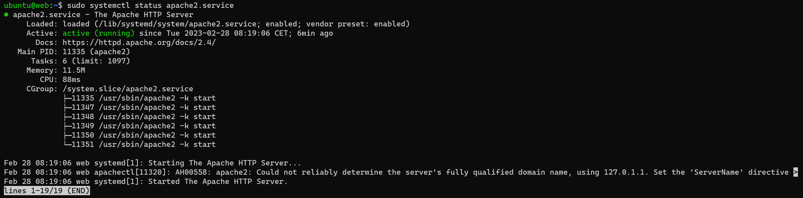
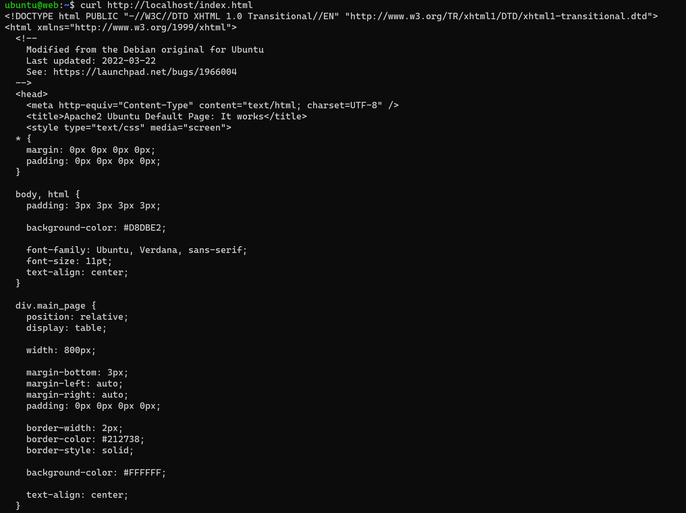
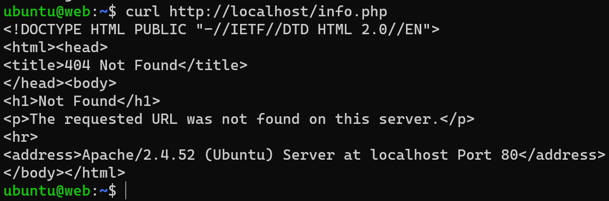
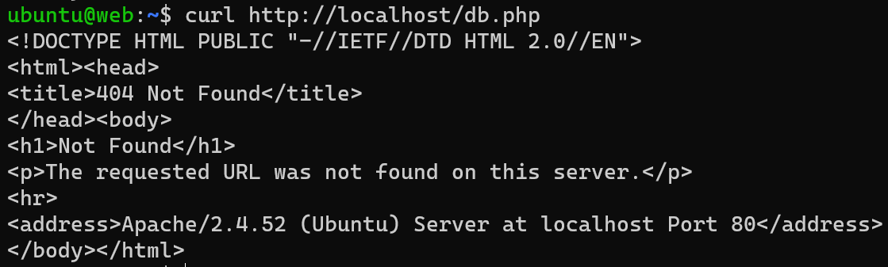
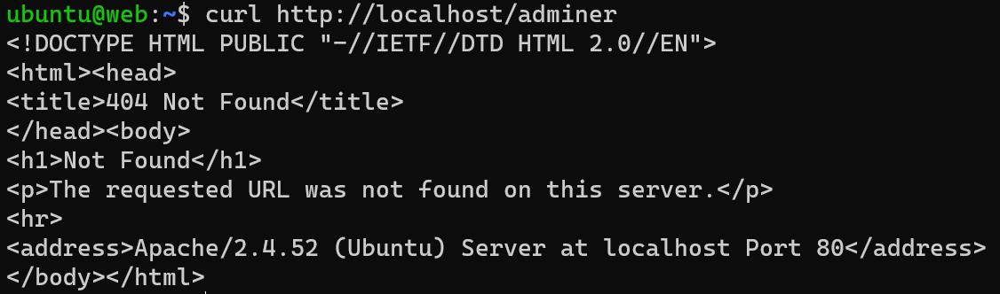

# KN02

## A)
<ul>
<li>users: Ein YAML-Listenelement, das eine Liste von Benutzerobjekten enthält. In diesem Fall wird nur ein Benutzer namens "ubuntu" definiert.
<ul>
<li>name: Das Attribut "name" des Benutzerobjekts, das den Benutzernamen "ubuntu" definiert.
<li>sudo: Das Attribut "sudo" des Benutzerobjekts, das die sudo-Berechtigungen für den Benutzer definiert.
<li>groups: Das Attribut "groups" des Benutzerobjekts, das die Gruppenzugehörigkeiten des Benutzers definiert. In diesem Fall gehört der Benutzer zu den Gruppen "users" und "admin".
<li>home: Das Attribut "home" des Benutzerobjekts, das das Heimatverzeichnis des Benutzers definiert.
<li>shell: Das Attribut "shell" des Benutzerobjekts, das die Standard-Shell des Benutzers definiert.
<li>lock_passwd: Das Attribut "lock_passwd" des Benutzerobjekts, das bestimmt, ob das Passwort des Benutzers gesperrt wird.
<li>plain_text_passwd: Das Attribut "plain_text_passwd" des Benutzerobjekts, das das Passwort des Benutzers im Klartext definiert. Beachten Sie, dass das Speichern von Passwörtern im Klartext nicht empfohlen wird.
</ul>
<li>ssh_pwauth: Ein boolscher Wert, der bestimmt, ob die Passwortauthentifizierung über SSH aktiviert ist.
disable_root: Ein boolscher Wert, der bestimmt, ob der Root-Zugriff über SSH deaktiviert ist.
<li>packages: Ein YAML-Listenelement, das eine Liste von Paketnamen enthält. In diesem Fall werden Apache, curl, wget, PHP und zugehörige Module installiert.
</ul>

## B)

## C)

Die Verbindung zum Port 80 ist fehlgeschlagen. Der apache2 Dienst wurde nicht gestartet oder ist nicht installiert.

Mit dem Befehl `apache2 -v` kann man überprüfen, ob es installiert ist, was in unserem Fall nicht der Fall ist.

apache installieren: `sudo apt-get install apache2`

Den Status kann man mit folgendem Befehl abfragen:
`sudo systemctl status apache2`

Starten tut man mit folgendem Befehl:
`sudo systemctl start apache2`

Neustarten tut man mit folgendem Befehl:
`sudo systemctl restart apache2`

Nun können die Seiten wie gewohnt aufgerufen werden.

Geht nicht, da mit Windows 10 Home keine IP für die Verbindung vorhanden ist.

Adminer

