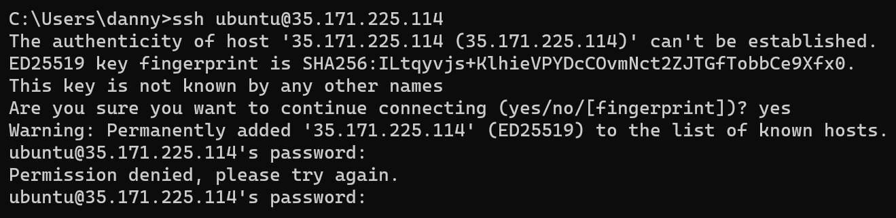

# KN03

## A)
### a)
#### EC2
Hier sieht man die Seite

Hier sieht man eine Liste der Instanzen mit dem Filter, von laufenden Instanzen

Hier sieht man die Details der erstellten Instanz. Public IPv4 address ist aufrufbar, sofern es richtig konfiguriert wurde.

Hier sieht man die richtig konfigurierten Security Groups. Damit wird der Zugriff mit HTTP erlaubt

### b)
#### S3

Hier sieht man eine Liste der Buckets

Hier sieht man die Seite

Hier sieht man die Objekte, die auf dem Bucket hochgeladen wurden und auf der Seite verfügbar sind.

Hier sieht man die Einstellung, womit es möglich ist die Webseite öffentlich aufzurufen.

## B)

### ssh_pwauth = true
ubuntu:

tbz

### ssh_pwauth = false

ubuntu:

tbz

## C)

Verbindung mit Danny-1:

Verbindung mit Danny-2:

## D)

Cloud-init config:

Verbindung mit Danny-1:

Verbindung mit Danny-2:
