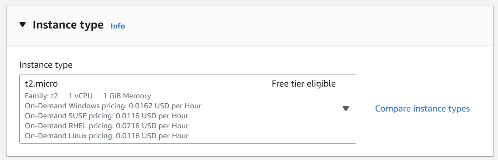
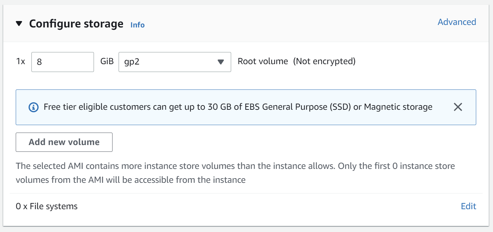
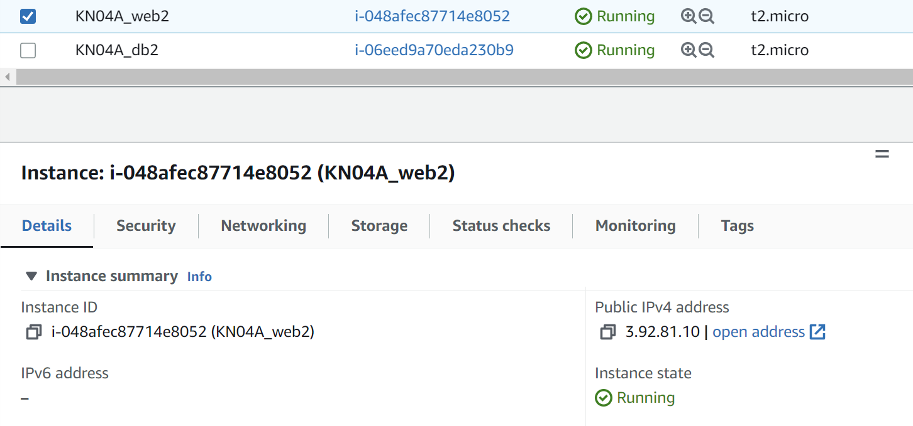
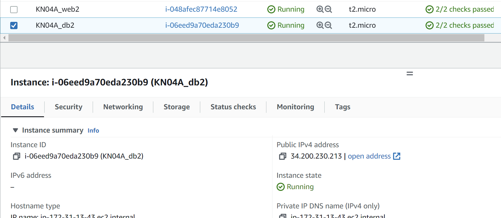
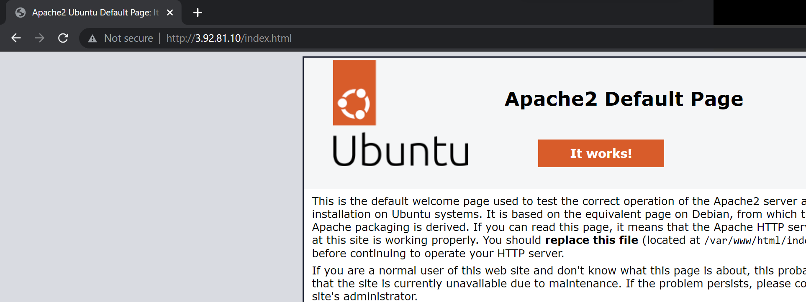
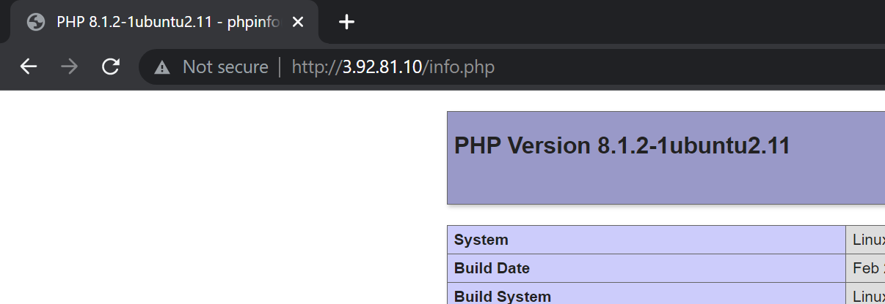
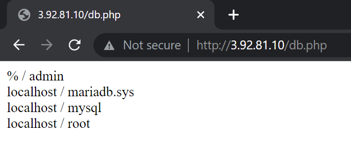
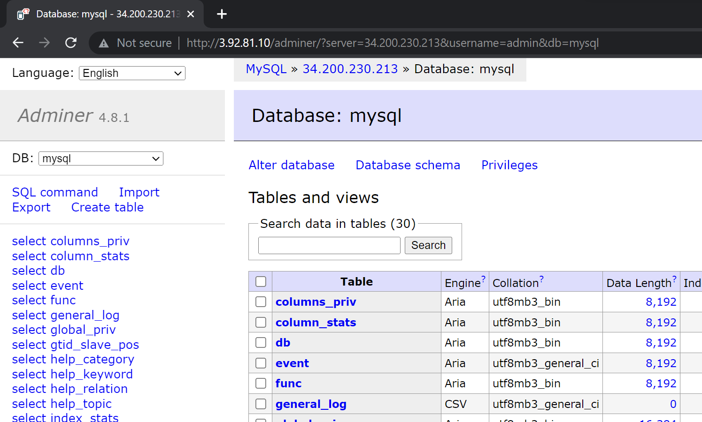
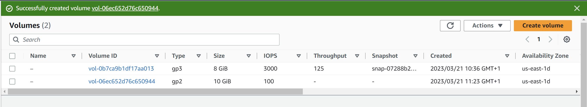
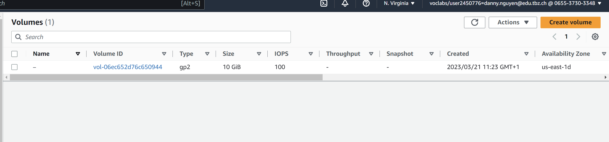

# KN03

## A)

#### Instanz-Erstellung:
Instanz Typ:


Speicher:


Feld "user data" (cloud-init web):
```
#cloud-config
users:
  - name: ubuntu
    sudo: ALL=(ALL) NOPASSWD:ALL
    groups: users, admin
    home: /home/ubuntu
    shell: /bin/bash
    lock_passwd: false
    plain_text_passwd: 'password'        
    ssh_authorized_keys:
      - ssh-rsa AAAAB3NzaC1yc2EAAAADAQABAAABAQC0WGP1EZykEtv5YGC9nMiPFW3U3DmZNzKFO5nEu6uozEHh4jLZzPNHSrfFTuQ2GnRDSt+XbOtTLdcj26+iPNiFoFha42aCIzYjt6V8Z+SQ9pzF4jPPzxwXfDdkEWylgoNnZ+4MG1lNFqa8aO7F62tX0Yj5khjC0Bs7Mb2cHLx1XZaxJV6qSaulDuBbLYe8QUZXkMc7wmob3PM0kflfolR3LE7LResIHWa4j4FL6r5cQmFlDU2BDPpKMFMGUfRSFiUtaWBNXFOWHQBC2+uKmuMPYP4vJC9sBgqMvPN/X2KyemqdMvdKXnCfrzadHuSSJYEzD64Cve5Zl9yVvY4AqyBD aws-key
ssh_pwauth: true
disable_root: false 
packages:
  - adminer
  - apache2 
  - curl 
  - wget 
  - php 
  - libapache2-mod-php 
  - php-mysqli
  - adminer
runcmd:
  - sudo a2enconf adminer
  - sudo systemctl restart apache2
write_files:
  - content: |
      <?php
        $servername = "34.200.230.213";
        $username = "admin";
        $password = "password";
        $dbname = "mysql";

        // Create connection
        $conn = new mysqli($servername, $username, $password, $dbname);
        // Check connection
        if ($conn->connect_error) {
                die("Connection failed: " . $conn->connect_error);
        }

        $sql = "select Host, User from mysql.user;";
        $result = $conn->query($sql);
        while($row = $result->fetch_assoc()){
                echo($row["Host"] . " / " . $row["User"] . "<br />");
        }
      ?>
    path: /var/www/html/db.php
    permissions: '0644'
    owner: root:root
    
  - content: |
      <?php
        phpinfo();
      ?>
    path: /var/www/html/info.php
    permissions: '0644'
    owner: root:root
```

Feld "user data" (cloud-init db):
```
#cloud-config
users:
  - name: ubuntu
    sudo: ALL=(ALL) NOPASSWD:ALL
    groups: users, admin
    home: /home/ubuntu
    shell: /bin/bash
    lock_passwd: false
    plain_text_passwd: 'password'    
    ssh_authorized_keys:
      - ssh-rsa AAAAB3NzaC1yc2EAAAADAQABAAABAQC0WGP1EZykEtv5YGC9nMiPFW3U3DmZNzKFO5nEu6uozEHh4jLZzPNHSrfFTuQ2GnRDSt+XbOtTLdcj26+iPNiFoFha42aCIzYjt6V8Z+SQ9pzF4jPPzxwXfDdkEWylgoNnZ+4MG1lNFqa8aO7F62tX0Yj5khjC0Bs7Mb2cHLx1XZaxJV6qSaulDuBbLYe8QUZXkMc7wmob3PM0kflfolR3LE7LResIHWa4j4FL6r5cQmFlDU2BDPpKMFMGUfRSFiUtaWBNXFOWHQBC2+uKmuMPYP4vJC9sBgqMvPN/X2KyemqdMvdKXnCfrzadHuSSJYEzD64Cve5Zl9yVvY4AqyBD aws-key
ssh_pwauth: true
disable_root: false
packages:
  - mariadb-server
runcmd:
  - sudo mysql -sfu root -e "GRANT ALL ON *.* TO 'admin'@'%' IDENTIFIED BY 'password' WITH GRANT OPTION;"
  - sudo sed -i 's/127.0.0.1/0.0.0.0/g' /etc/mysql/mariadb.conf.d/50-server.cnf
  - sudo systemctl restart mariadb.service
```

Hier sieht man die zwei Instanzen:



index.html:


info.php:


db.php:


adminer nach dem einloggen:


## B)

### a)
S3 ist ein Objektspeichermodell. Objektspeicher sind ein Speichermodell, bei dem Daten als Objekte behandelt und in einem flachen Adressraum organisiert werden, im Gegensatz zu traditionellen Dateisystemen, die hierarchische Verzeichnisstrukturen verwenden.
### b)




Wenn eine Instanz aufgrund von Fehlern oder Problemen unbrauchbar geworden ist, aber wichtige Daten auf dem Volume gespeichert sind. In diesem Fall könnte man eine neue Instanz starten und das vorhandene Volume wieder anhängen, um auf die Daten zuzugreifen.