# KN05

## A)

### Leere Bereiche:
Instanzen
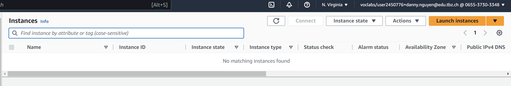

Network Interfaces
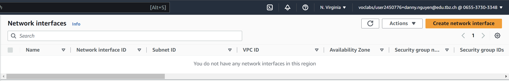

Security Groups
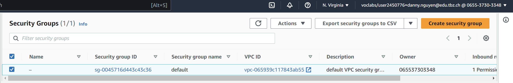

VPC
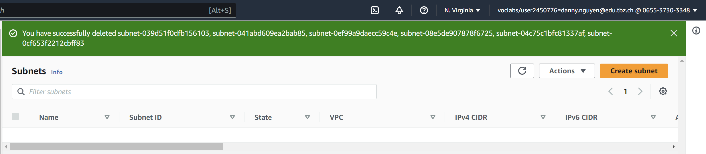

## B)

### Subnetz
Neues Subnetz erstellen
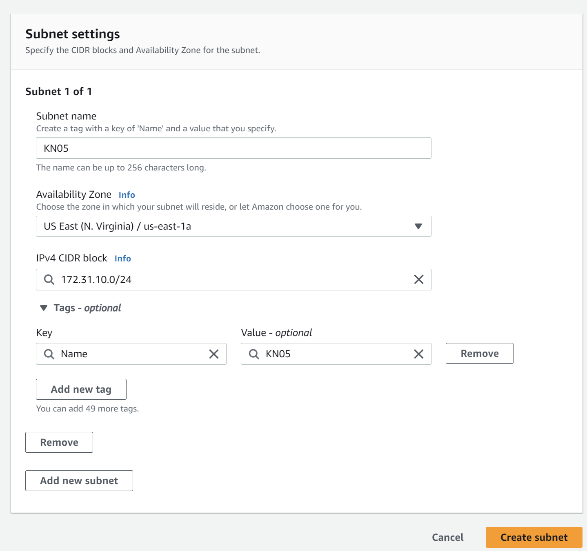
Enable auto-assign public PV44 address für öffentliche IP
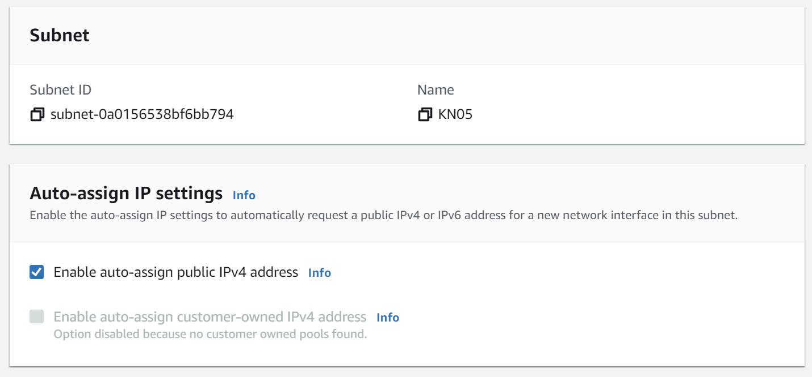
Subnetz Liste:
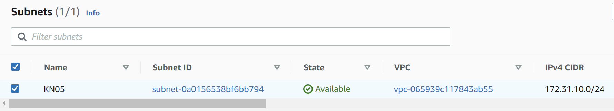

Elastic IPs
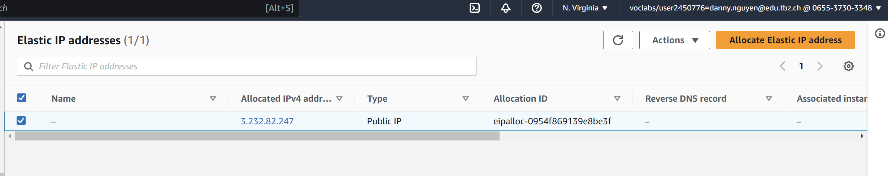

Security Groups
KN05_db:
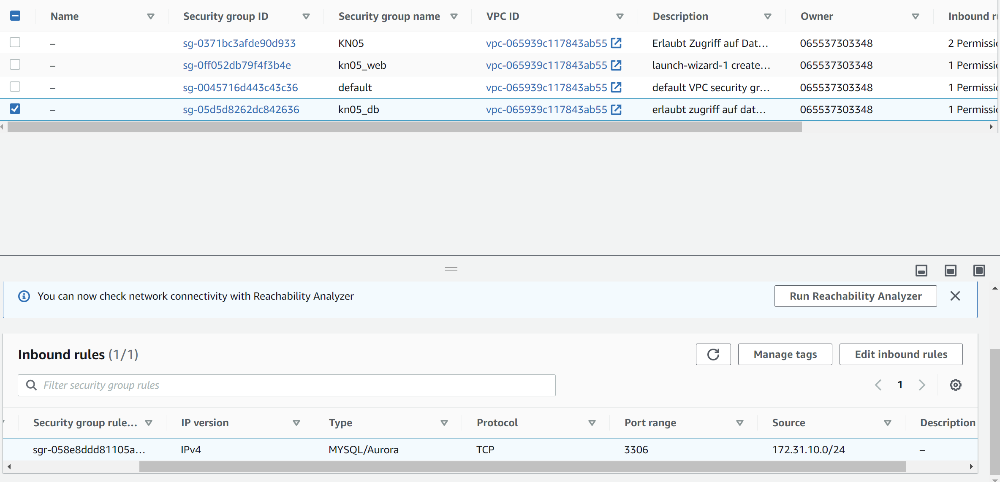
KN05_web:
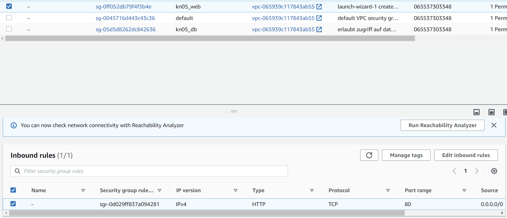
Im Nachhinein wurde nochmal HTTP hinzugefügt, damit die Seite aufgerufen werden kann.
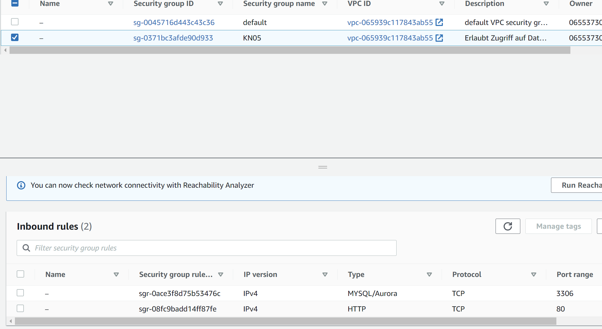

### Netzwerk-Interfaces
Liste
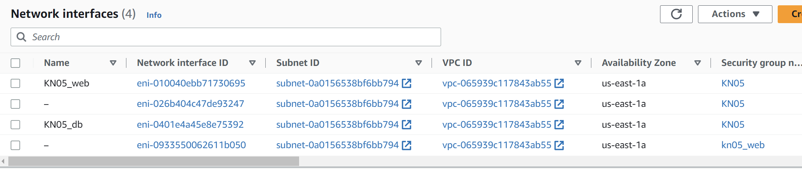
DB Details:
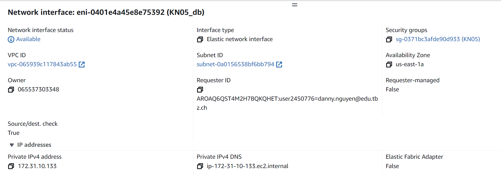
Web Details:
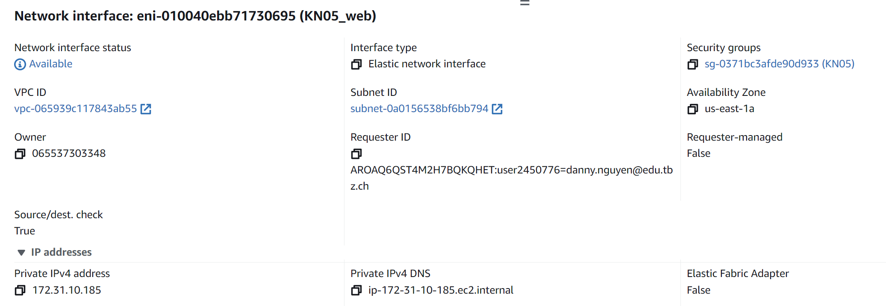

Feld "user data" (cloud-init web):
```
#cloud-config
users:
  - name: ubuntu
    sudo: ALL=(ALL) NOPASSWD:ALL
    groups: users, admin
    home: /home/ubuntu
    shell: /bin/bash
    ssh_authorized_keys:
      - ssh-rsa AAAAB3NzaC1yc2EAAAADAQABAAABAQC0WGP1EZykEtv5YGC9nMiPFW3U3DmZNzKFO5nEu6uozEHh4jLZzPNHSrfFTuQ2GnRDSt+XbOtTLdcj26+iPNiFoFha42aCIzYjt6V8Z+SQ9pzF4jPPzxwXfDdkEWylgoNnZ+4MG1lNFqa8aO7F62tX0Yj5khjC0Bs7Mb2cHLx1XZaxJV6qSaulDuBbLYe8QUZXkMc7wmob3PM0kflfolR3LE7LResIHWa4j4FL6r5cQmFlDU2BDPpKMFMGUfRSFiUtaWBNXFOWHQBC2+uKmuMPYP4vJC9sBgqMvPN/X2KyemqdMvdKXnCfrzadHuSSJYEzD64Cve5Zl9yVvY4AqyBD aws-key
ssh_pwauth: true
disable_root: false
packages:
  - adminer
  - apache2 
  - curl 
  - wget 
  - php 
  - libapache2-mod-php 
  - php-mysqli
  - adminer
runcmd:
  - sudo a2enconf adminer
  - sudo systemctl restart apache2
write_files:
  - content: |
      <?php
        $servername = "172.31.10.175";
        $username = "admin";
        $password = "password";
        $dbname = "mysql";

        // Create connection
        $conn = new mysqli($servername, $username, $password, $dbname);
        // Check connection
        if ($conn->connect_error) {
                die("Connection failed: " . $conn->connect_error);
        }

        $sql = "select Host, User from mysql.user;";
        $result = $conn->query($sql);
        while($row = $result->fetch_assoc()){
                echo($row["Host"] . " / " . $row["User"] . "<br />");
        }
      ?>
    path: /var/www/html/db.php
    permissions: '0644'
    owner: root:root
    
  - content: |
      <?php
        phpinfo();
      ?>
    path: /var/www/html/info.php
    permissions: '0644'
    owner: root:root
```

Feld "user data" (cloud-init db):
```
#cloud-config
users:
  - name: ubuntu
    sudo: ALL=(ALL) NOPASSWD:ALL
    groups: users, admin
    home: /home/ubuntu
    shell: /bin/bash
    lock_passwd: false
    plain_text_passwd: 'password'    
    ssh_authorized_keys:
      - ssh-rsa AAAAB3NzaC1yc2EAAAADAQABAAABAQC0WGP1EZykEtv5YGC9nMiPFW3U3DmZNzKFO5nEu6uozEHh4jLZzPNHSrfFTuQ2GnRDSt+XbOtTLdcj26+iPNiFoFha42aCIzYjt6V8Z+SQ9pzF4jPPzxwXfDdkEWylgoNnZ+4MG1lNFqa8aO7F62tX0Yj5khjC0Bs7Mb2cHLx1XZaxJV6qSaulDuBbLYe8QUZXkMc7wmob3PM0kflfolR3LE7LResIHWa4j4FL6r5cQmFlDU2BDPpKMFMGUfRSFiUtaWBNXFOWHQBC2+uKmuMPYP4vJC9sBgqMvPN/X2KyemqdMvdKXnCfrzadHuSSJYEzD64Cve5Zl9yVvY4AqyBD aws-key
ssh_pwauth: true
disable_root: false
packages:
  - mariadb-server
runcmd:
  - sudo mysql -sfu root -e "GRANT ALL ON *.* TO 'admin'@'%' IDENTIFIED BY 'password' WITH GRANT OPTION;"
  - sudo sed -i 's/127.0.0.1/0.0.0.0/g' /etc/mysql/mariadb.conf.d/50-server.cnf
  - sudo systemctl restart mariadb.service
ethernets:
ens3:
dhcp4: false
addresses:
- 172.31.10.10/24
```

KN05_web Instanz Details
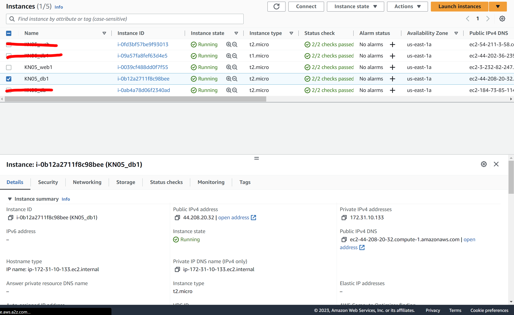
KN05_db Instanz Details
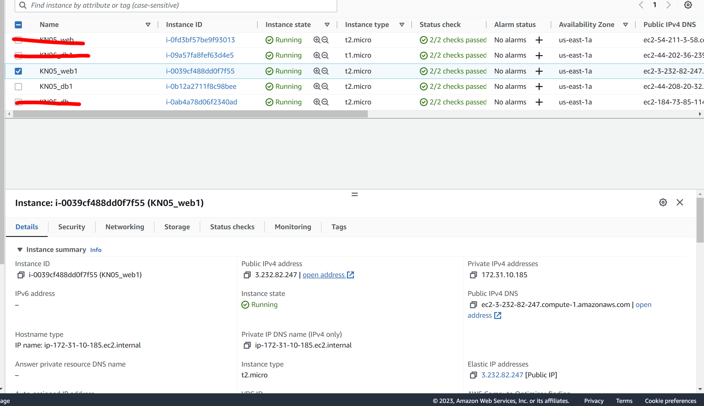

Einstellungen Network settings
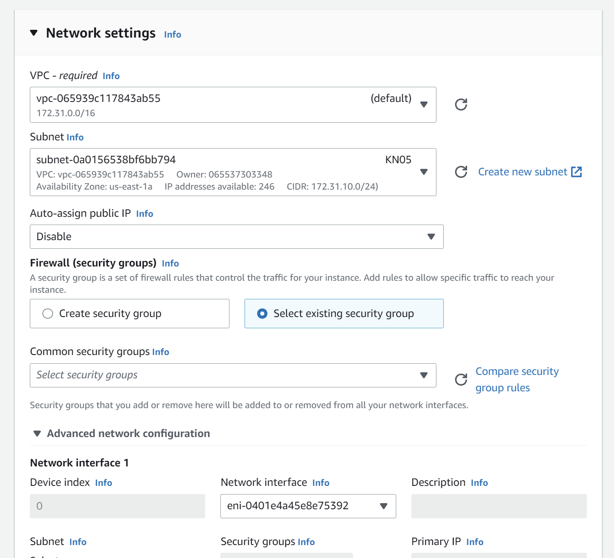
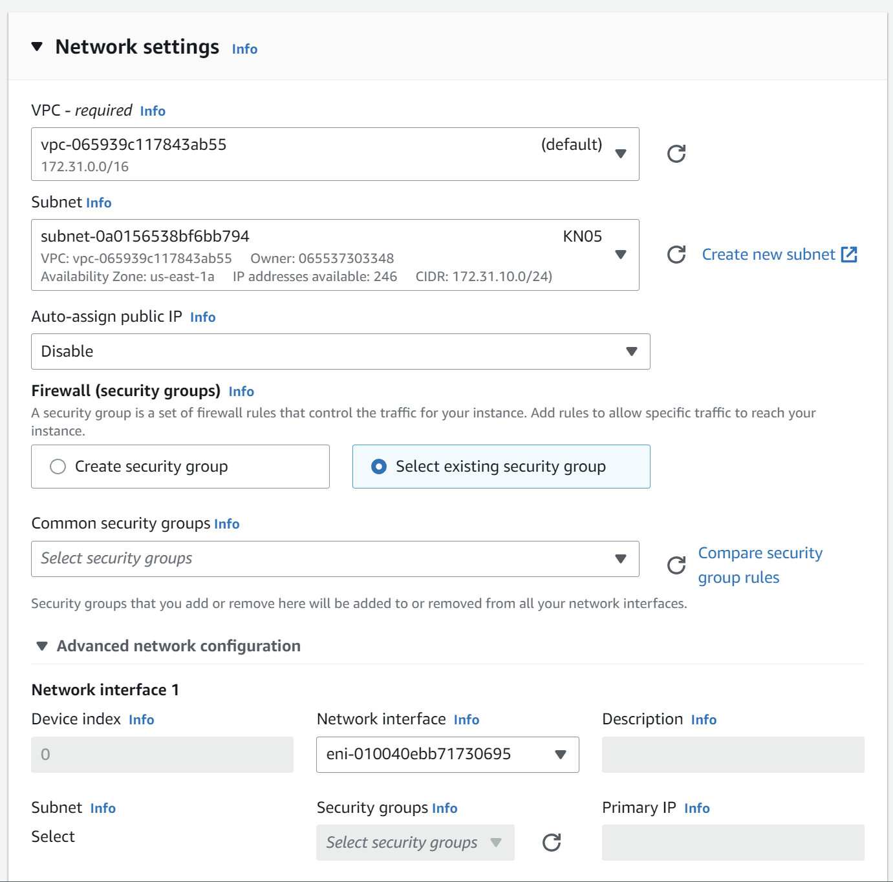

Webseiten
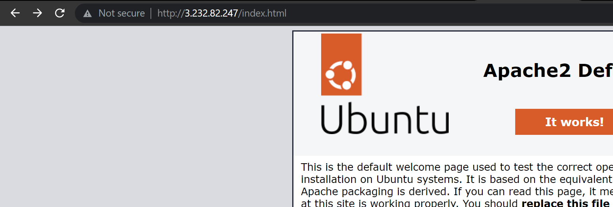
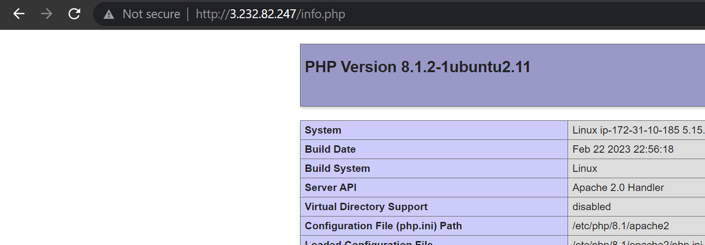
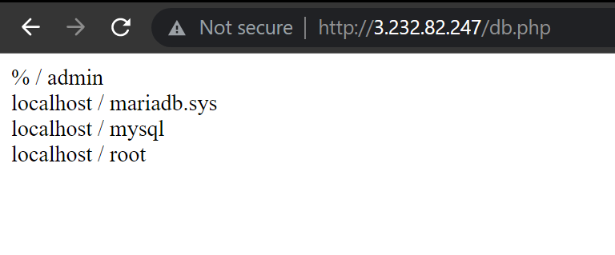