# KN06

## A)

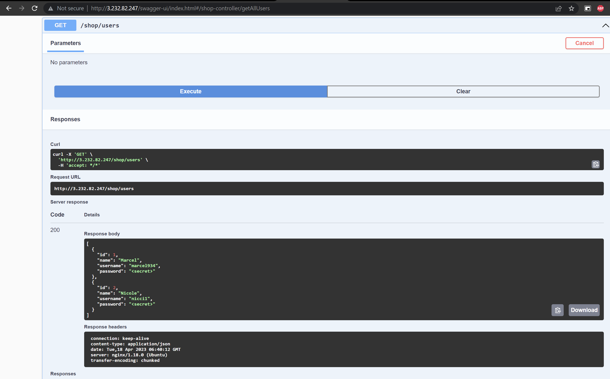

## B)

### DB

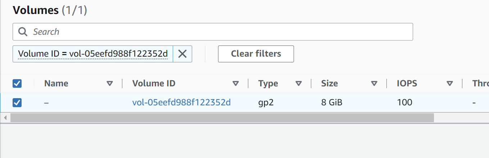
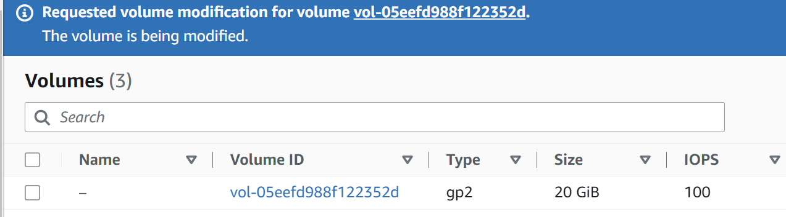
### Web
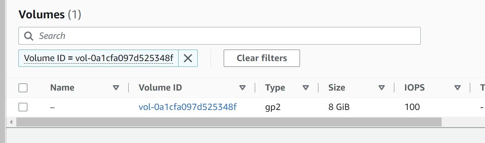
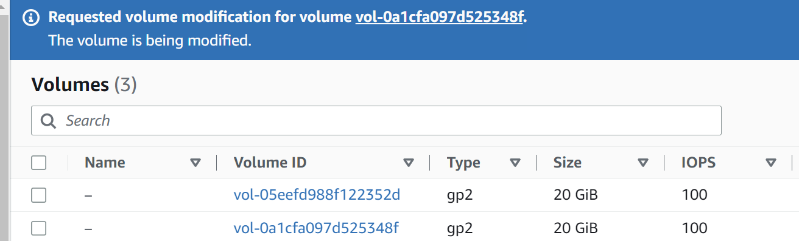

Instanz-Typ

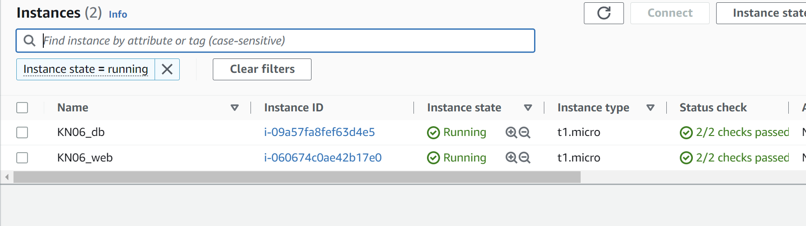
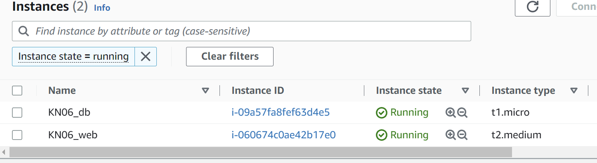

## C)
<ul>
<li>Load Balancer-Type: Application Load Balancer
<li>Sicherheitsgruppen für HTTP-Requests (bzw. die der Web-Instanzen)
<li>Neues Network-Interface erstellen
</ul>

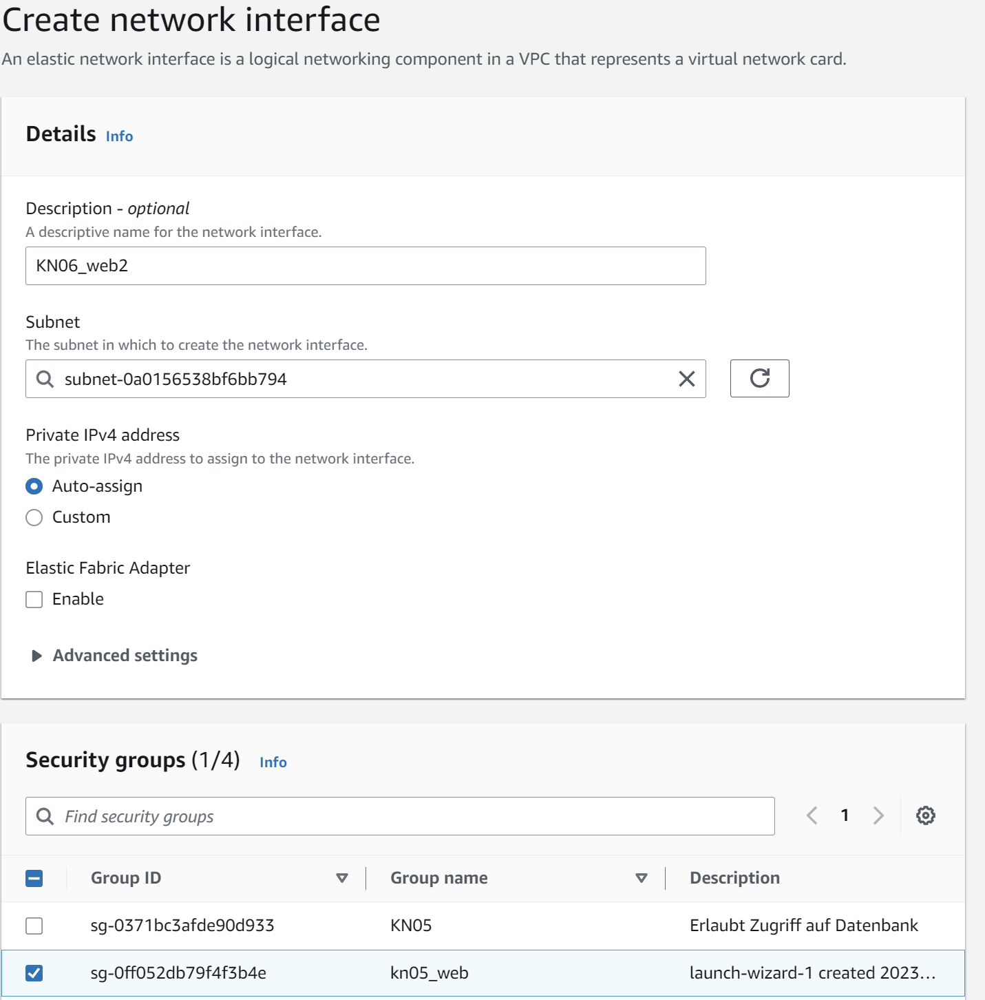
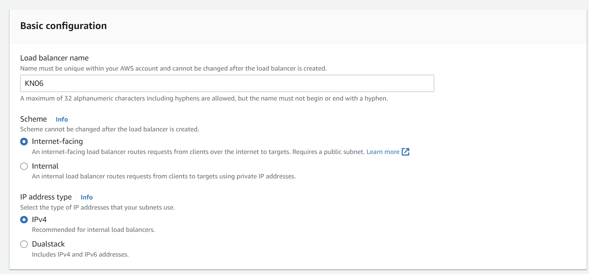
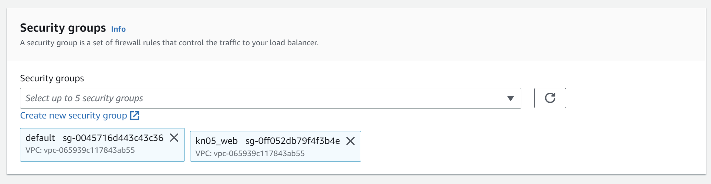
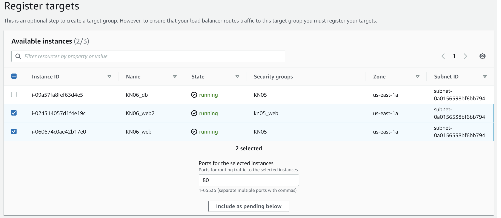
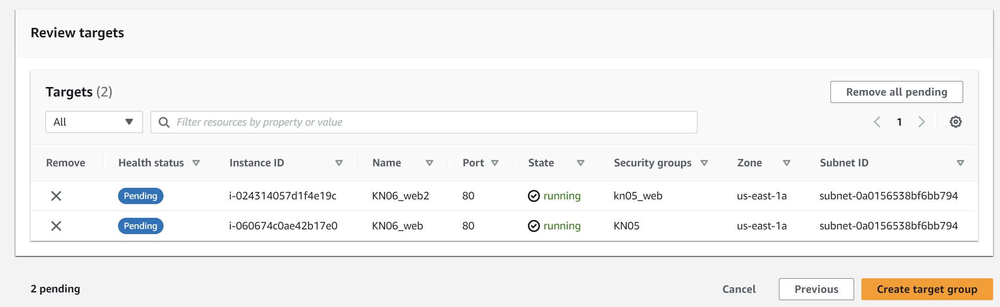
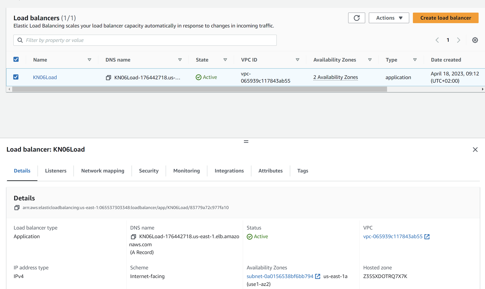

## C)
<ul>
<li>Launch Template wie eine Web-Instanz
</ul>

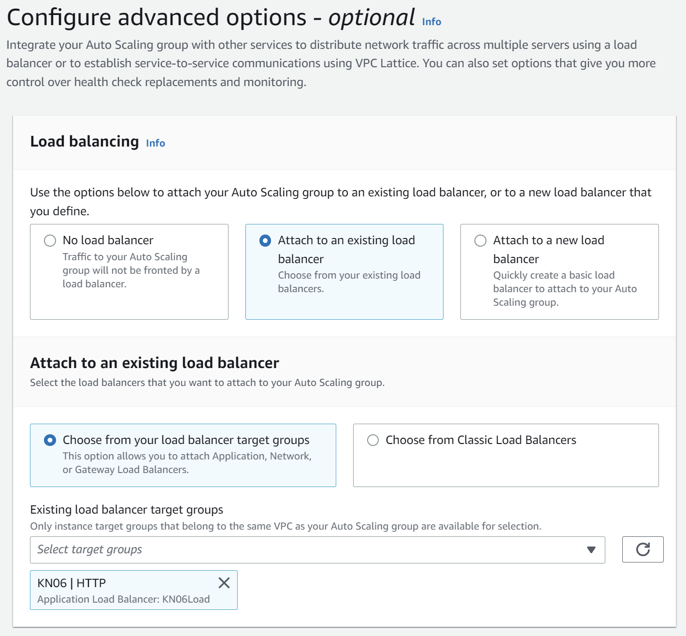
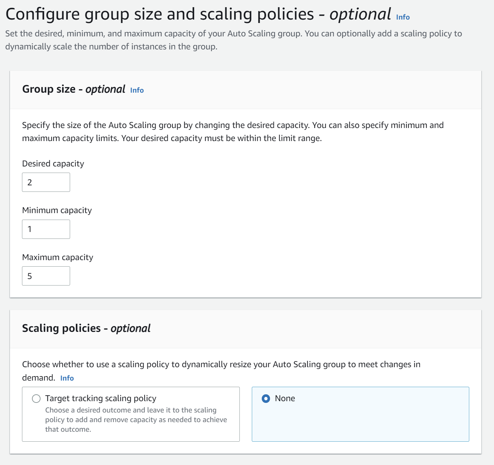