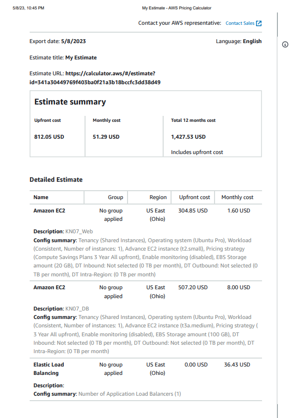
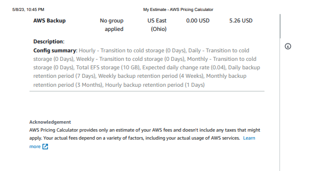
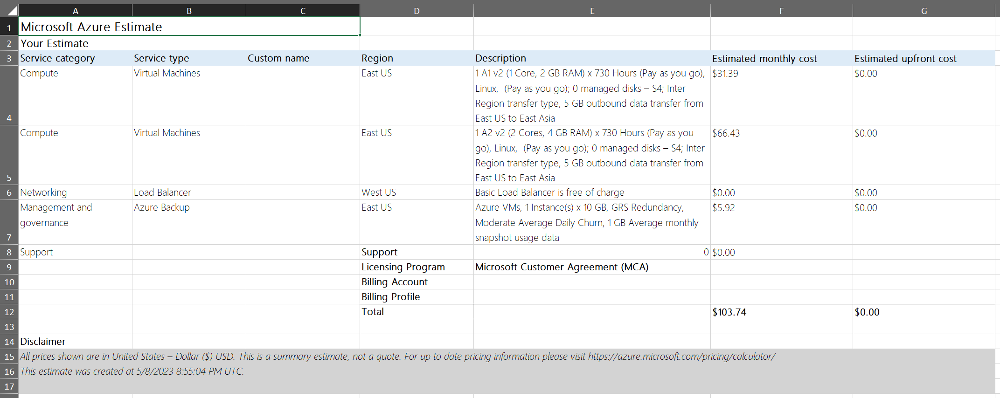
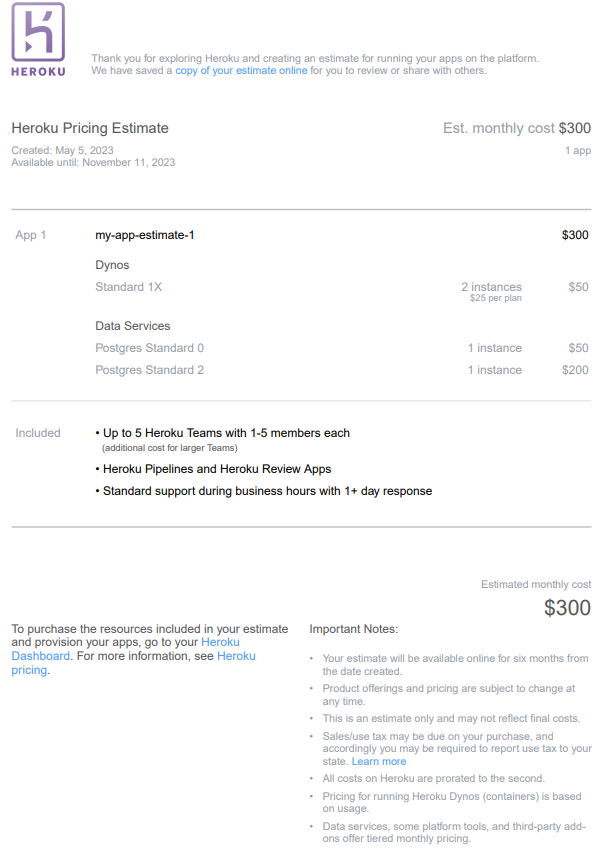
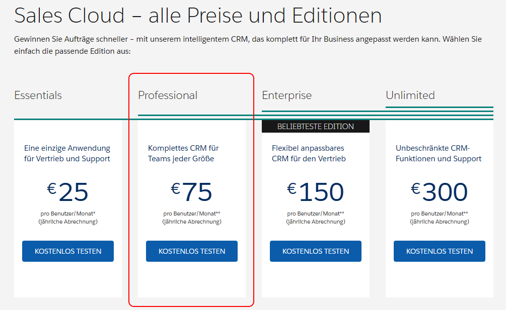

# KN07

## A)
### 1) Rehosting

AWS:

Azure:

Wieso AWS besser als Azure ist:
<ul>

<li>Breitere Auswahl an Services: AWS bietet eine breitere Palette an Diensten und Optionen als Azure, was es einfacher macht, die spezifischen Bedürfnisse Ihres Unternehmens zu erfüllen.

<li>Größere Community: AWS hat eine größere Nutzergemeinschaft als Azure, was bedeutet, dass es mehr Ressourcen und Support verfügbar gibt, um Probleme zu lösen und Wissen zu teilen.

<li>Bessere Skalierbarkeit: AWS hat eine bessere Skalierbarkeit und Flexibilität, was es einfacher macht, das System zu erweitern und zusätzliche Ressourcen hinzuzufügen.

<li>Höhere Zuverlässigkeit: AWS verfügt über mehrere Verfügbarkeitszonen und Regionen, die eine höhere Zuverlässigkeit und eine bessere Disaster Recovery-Fähigkeit bieten.

</ul>

### 2) Replatforming

Heroku ist eine Plattform-as-a-Service (PaaS), die von Salesforce entwickelt wurde und auf der Entwickler Anwendungen in verschiedenen Programmiersprachen und Frameworks bereitstellen können. Es ermöglicht Entwicklern, Anwendungen schnell und einfach zu erstellen, zu deployen und zu skalieren, ohne sich um die Infrastruktur kümmern zu müssen.

Obwohl Heroku viele Vorteile hat, wie z.B. die Einfachheit der Bereitstellung von Anwendungen und die Möglichkeit, auf viele verschiedene Datenquellen zuzugreifen, gibt es einige Gründe, warum es sich gegenüber AWS und Azure möglicherweise nicht lohnt. Zum einen kann Heroku im Vergleich zu den großen Cloud-Anbietern teurer sein, insbesondere bei größeren Anwendungen mit hohem Datenaufkommen. Darüber hinaus kann die Flexibilität bei der Konfiguration von Ressourcen und Services auf Heroku eingeschränkt sein. Auch die Verfügbarkeit von Ressourcen und Diensten kann bei Heroku eingeschränkter sein, da es sich um eine auf bestimmte Technologien spezialisierte Plattform handelt.

### 3) Repurchasing

Die Auswahl zwischen Zoho CRM und Salesforce Sales Cloud hängt von den spezifischen Anforderungen der Firma ab. Beide Anbieter bieten SaaS-Lösungen für CRM-Systeme an, die einfach zu nutzen und schnell einzurichten sind. Die Entscheidung hängt von Faktoren wie Funktionalität, Integration mit anderen Systemen, Preis, Benutzerfreundlichkeit und Kundensupport ab.

Im Vergleich zu IaaS und PaaS-Lösungen bieten SaaS-Lösungen wie Zoho CRM und Salesforce Sales Cloud den Vorteil, dass sie sich schnell und einfach implementieren lassen, ohne dass die Firma eigene Infrastruktur bereitstellen muss. Allerdings kann es bei der Anpassung der Lösung an spezifische Anforderungen der Firma Einschränkungen geben.

Zusätzlich zu den genannten Faktoren müsste man bei der Auswahl einer CRM-Lösung auch Aspekte wie Datensicherheit, Datenschutz, Verfügbarkeit und Skalierbarkeit berücksichtigen.